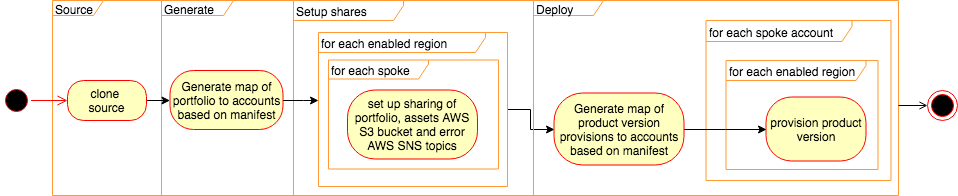
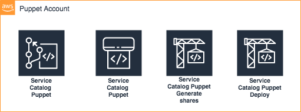

Getting up and running
======================

ServiceCatalog-Puppet runs in your AWS Account.  In order for you to install it into your account you can use the 
aws-service-catalog-puppet cli.  This is distributed via [PyPi](https://pypi.org/project/aws-service-catalog-puppet/)

What am I going to install?
---------------------------

ServiceCatalog-Puppet is bootstrapped from your local machine.  You install a command line utility that will provision
the resources you need into your AWS Account.  Once you have completed the bootstrap you will have the following pipeline
in your account:

using the following services:

Before you install
------------------

You should consider which account will be the home for your puppet.  This account will contain the AWS CodePipelines
and will need to be accessible to any accounts you would like to share with.  If you are using ServiceCatalog-Factory,
we recommend you install both tools into the same account. 
 

Installing the tool
-------------------

This is a python cli built using Python 3.

It is good practice to install Python libraries in isolated environments.  You can create the a virtual environment using
the following command:

.. code-block:: bash

    virtualenv --python=python3.7 venv
    source venv/bin/activate

Once you have decided where to install the library you can install the package:

.. code-block:: bash

    pip install aws-service-catalog-puppet

This will install the library and all of the dependencies.

Setting it up
-------------

The Puppet will run in your account and needs some configuration.  You will need to stand up the puppet and set up the 
configuration for it to run smoothly.

You will also need to provision an IAM Role within the *spoke* accounts - those you want to provision products in.

Bootstrap your spokes
~~~~~~~~~~~~~~~~~~~~~

You will need to bootstrap each of your spokes.  In order to do so please export your credentials and then run:

.. code-block:: bash

    servicecatalog-puppet bootstrap-spoke <ACCOUNT_ID_OF_YOUR_PUPPET>

Bootstrap your account
~~~~~~~~~~~~~~~~~~~~~~

There are two or threes parts to bootstrapping the puppet.  

Setting up your global configuration
^^^^^^^^^^^^^^^^^^^^^^^^^^^^^^^^^^^^
The first is concerned with setting the global configurations.  
To do this we use AWS SSM Parameters.  To get setup you need to create a configuration file with a list of regions you want to 
use.  You must also specify if you want to collect the CloudFormation events from provisioning actions via SQS.

Here is an example config.yaml:

.. code-block:: yaml

    regions: [
      'us-east-2',
      'us-east-1',
      'us-west-1',
      'us-west-2',
      'ap-south-1',
      'ap-northeast-2',
      'ap-southeast-1',
      'ap-southeast-2',
      'ap-northeast-1',
      'ca-central-1',
      'eu-west-1',
      'eu-west-2',
      'eu-west-3',
      'sa-east-1',
    ]
    should_collect_cloudformation_events: false
    should_forward_events_to_eventbridge: true
    should_forward_failures_to_opscenter: true

.. note::

    should_collect_cloudformation_events was added in version 0.33.0

.. note::

    should_forward_events_to_eventbridge was added in version 0.35.0
    should_forward_failures_to_opscenter was added in version 0.35.0

Once you have this file you need to upload the config:

.. code-block:: bash

    servicecatalog-puppet upload-config config.yaml

If you make changes to this you will need to run upload-config and bootstrap commands again for the changes to occur.

Once that has completed you are ready to bring up the rest of the puppet.

Setting to to use AWS Organizations
^^^^^^^^^^^^^^^^^^^^^^^^^^^^^^^^^^^

The second part to bootstrapping is optional.  If you would like to use AWS Organizations features in your manifest file 
you will need to set which IAM Role should be used to perform these actions.  

To create the correct role in your organization master export your credentials or change profile and run the following:

.. code-block:: bash

    servicecatalog-puppet bootstrap-org-master <ACCOUNT_ID_OF_YOUR_PUPPET>

This command will provision a role the account you specified and output the ARN of the role.

Once you have the ARN or you know the ARN you want to use you can configure the framework to use it.  Export the 
credentials for your puppet account or change your profile so you are using your puppet account and run the following 
command:

.. code-block:: bash

    servicecatalog-puppet set-org-iam-role-arn <THE_ARN_YOU_WANT_TO_USE>  

Once you have run that command you are ready for the final stage.

Configuring your puppet
^^^^^^^^^^^^^^^^^^^^^^^

When you bootstrap your account you can choose whether to have a manual approval step in your deployment pipeline.

If you choose to enable manual approvals an AWS SNS Topic with the ARN
``arn:aws:sns:${AWS::Region}:${AWS::AccountId}:service-catalog-puppet-dry-run-approvals`` will be created to notify you
when approvals are required.

It may be required to set the default Region for the next command to work. 

.. code-block:: bash
    export AWS_DEFAULT_REGION=eu-west-1

To start the bootstrap process you must run the following in your master account:

.. code-block:: bash

    servicecatalog-puppet bootstrap

If you want to enable manual approvals you must bootstrap using the following command:

.. code-block:: bash

    servicecatalog-puppet bootstrap --with-manual-approvals

Setup your puppet
~~~~~~~~~~~~~~~~~

Clone the configuration repo and configure your factory by editing the ``manifest.yaml`` file:

.. code-block:: bash

    git clone --config 'credential.helper=!aws codecommit credential-helper $@' --config 'credential.UseHttpPath=true' https://git-codecommit.eu-west-1.amazonaws.com/v1/repos/ServiceCatalogPuppet
    servicecatalog-puppet seed simple ServiceCatalogPuppet
    cd ServiceCatalogPuppet
    vim manifest.yaml
    git add .
    git commit -am "initial add"
    git push

Wait for pipeline to complete and you have a working puppet.
