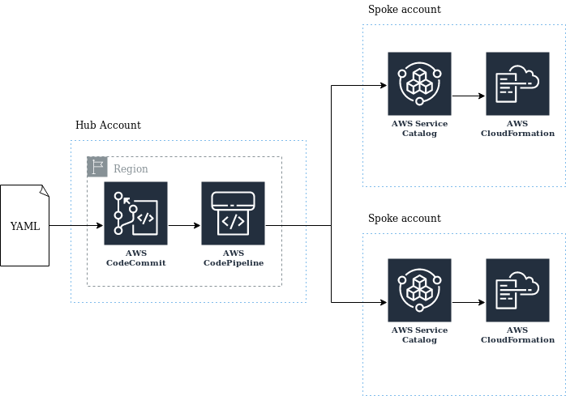

What is this?
=============

Service Catalog Puppet is a framework that enables you to provision service
catalog products into accounts that need to have them. You declare your service
catalog products and the accounts you want them to be available in via a
configuration file. Service Catalog Puppet then walks through this configuration
file and determines which products need to be made available in which accounts.
You can use tags or account numbers to indicate which products should be
available in which accounts. For example if using tags for both accounts and
products, products tagged dev will be made available in accounts tagged dev.

The framework works through your lists, dedupes and spots collisions and
then provisions the products into your AWS accounts for you. It handles Service
Portfolio sharing, accepting Portfolio shares and can provision products cross
account and cross region.

### High level architecture diagram

You use an AWS CodeBuild project in a central _hub_ account that provisions AWS
Service Catalog Products into _spoke_ accounts on your behalf.  The framework
takes care of cross account sharing and cross region product replication for
you.
